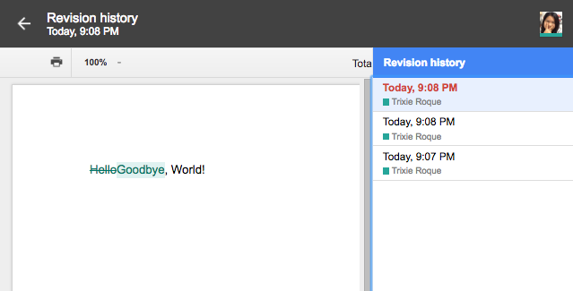
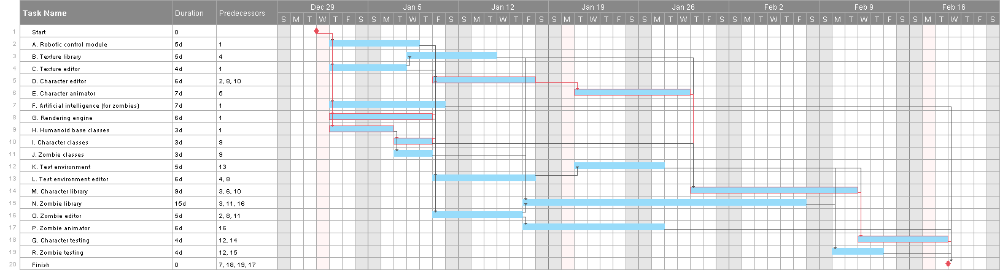

# Homework 1 - Due 01/30/17 @ 6pm PST

**Problem 1.1, Stephens Page 12**
:  What are the basic tasks that all software engineering projects must handle?
> requirements gathering, high-level design, low-level design, development, testing, deployment, maintenance, and wrap-up

**Problem 1.2, Stephens page 12**
: Give a one sentence description of each of the tasks you listed in Exercise 1.
> * requirements gathering - Discover what the customer’s specifications are.
> * high-level design - Describe the major parts of the application and how they interact with one another.
> * low-level design - Provide details about how to build the parts of the application so that the programmers can actually implement them.
> * development - Program the application.
> * testing - Use the application to detect bugs by using different edge cases.
> * deployment - Publish the application to be accessed by users.
> * maintenance - Fix bugs, provide additional features and enhancements, and release future versions of the program.
> * wrap-up - Evaluate the project’s history to determine what went right and what went wrong so they can be better applied in future projects.

**Problem 2.4, Stephens page 26**
: Like Microsoft Word, Google Docs [sic] provides some simple change tracking tools. Go to http://www.google.com/docs/about/ to learn more and sign up [if you do not have an account already]. Then create a document, save it, close it, reopen it, and make changes to it as you did in Exercise 1.
> 

**Problem 2.5, Stephens page 26**
: What does JBGE stand for and what does it mean?
> JBGE, or Just Barely Good Enough, is the idea that you shouldn't write any more code documentation or comments than is absolutely necessary.

**Problem 3.2, Stephens page 51**
: Use critical path methods to find the total expected time from the project's start for each task's completion. Find the critical path. What are the tasks on the critical path? What is the total expected duration of the project in working days?
> For the critical path(s), see the paths outline in red in the **Gantt Chart for Problem 3.4**. More specifically, one of the critical paths contains tasks G (Rendering engine), D (Character editor), E (Character animator), M (Character library), and Q (Character testing). Based on this, the total expected time is 6+6+7+9+4 = 32 working days.

**Problem 3.4, Stephens page 51**
: Build a Gantt chart for the network you drew in Exercise 3. [Yes, I know, you weren't assigned that one — however, when you do Exercise 2 you should have enough information for this one.] Start on Wednesday, January 1, 2020, and don't work on weekends or the following holidays: New Year's Day - January 1, Martin Luther King, Jr. Day - January 20, President's Day - February 17.
> Gantt Chart (Click to expand)

> Note that each item under Predecessors corresponds to the row number of the task in the table.

**Problem 3.6, Stephens page 51**
: In addition to losing time from vacation and sick leave, projects can suffer from problems that just strike out of nowhere. Sort of a bad version of deus ex machina. For example, senior management could decide to switch your target platform from Windows desktop PSs to the latest smartwatch technology. Or a strike in the Far East could delay the shipment of your new servers. Or one of your developers might move to Iceland. How can you handle these sorts of completely unpredictable problems?
> Problems that strike out of nowhere can be handled similarly to unexpected sick leaves. When these problems arise, one can add tasks at the end of the schedule to account for the unexpected problems. When one of these problems does occur, the lost time can be easily inserted into the schedule.

**Problem 3.8, Stephens page 51**
: What are the two biggest mistakes you can make while tracking tasks?
> One of the biggest mistakes you can make while tracking tasks is to not take action when a task is not completely fulfilled. At a minimum, the developer will have to pay closer attention to the task so that they can always take action if they feel the task cannot be accomplished.

> The second biggest mistake is having more people swarm on the task and mistakenly assuming that this will reduce the time it takes to finish. Bringing new people who are inexperienced with the project can take up more time since they will have to spend time learning the new task.

**Problem 4.1, Stephens page 82**
: List five characteristics of good requirements.
> clear, unambiguous, consistent, prioritized, verifiable

**Problem 4.3, Stephens page 82**
: Suppose you want to build a program called TimeShifter to upload and download files at scheduled times while you're on vacation. The following list shows some of the applications requirements.

  * Allow users to monitor uploads/downloads while away from the office.  
    **Answer:** Business
  * Let the user specify website log-in parameters such as an Internet address, a port, a username, and a password.  
    **Answer:** User, Functional
  * Let the user specify upload/download parameters such a number of retries if there's a problem.  
    **Answer:** User, Functional
  * Let the user select an Internet location, a local file, and a time to perform the upload/download.  
    **Answer:** User, Functional
  * Let the user schedule uploads/downloads at any time.  
    **Answer:** Nonfunctional
  * Allow uploads/downloads to run at any time.  
    **Answer:** Nonfunctional
  * Make uploads/downloads transfer at least 8 Mbps.  
    **Answer:** Nonfunctional
  * Run uploads/downloads sequentially. Two cannot run at the same time.  
    **Answer:** Nonfunctional
  * If an upload/download is scheduled for a time when another is in progress, it waits until the other one finishes.  
    **Answer:** Nonfunctional
  * Perform schedule uploads/downloads.  
    **Answer:** Functional
  * Keep a log of all attempted uploads/downloads and whether the succeeded.  
    **Answer:** Functional
  * Let the user empty the log.  
    **Answer:** User, Functional
  * Display reports of upload/download attempts.  
    **Answer:** User, Functional
  * Let the user view the log reports on a remote device such as a phone.  
    **Answer:** User, Functional
  * Send an e-mail to an administrator if an upload/download fails more than its maximum retry number of times.  
    **Answer:** User, Functional
  * Send a text message to an administrator if an upload/download fails more than it's maximum return number of times.  
    **Answer:** User, Functional

For this exercise, list the audience-oriented categories for each requirement. Are there requirements in each category? [If not, state why not…]
> Only the Implementation category does not contain requirements, while the rest have at least one. The reason why there are none in the Implementation category is that even though other hardware or network specifications might be needed to support the application, the developer might not need the implementations since doing the upload/downloads for the application are presumably already being accomplished.

**Problem 4.9, Stephens page 83-84**
: Figure 4-1 [right] shows the design for a simple hangman game that will run on smartphones. When you click the New Bame button, the program picks a random mystery word from a large list and starts a new game. Then if you click a letter, either the letter is filled in where it appears in the mystery word, or a new piece of Mr. Bones's skeleton appears. In either case, the letter you clicked is grayed out so that you don't pick it again. If you guess all the letters in the mystery word, the game displays a message that says, "Congratulations, you won!" If you build Mr. Bones's complete skeleton, a message says, "Sorry, you lost." Brainstorm this application and see if you can think of ways you might change it. Use the MOSCOW method to prioritize your changes.
> * Add advertisements to monetize the hangman game. (Must have)
> * A scoring system can be added for each of the players. Players can also try to beat previous high scores. (Should have)
> * Allow user the ability to change the background color. (Could have)
> * A "solve" option can be added to allow players to give up on solving a word. This feature seems more applicable for timed game sessions. (Could have)
> * Include a timer and counter to keep track of how many words the player can solve before they lose. (Won't have)
> * Allow users to drag and drop letters in place instead of just clicking each letter. (Won't have)
