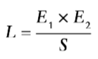

# Homework 3 - Due 03/12/17 @ 4:20pm PST

**Problem 7.1, Stephens page 169**
> The greatest common divisor (GCD) of two integers is the largest integer that evenly divides them both. For example, the GCD of 84 and 36 is 12, because 12 is the largest integer that evenly divides both 84 and 36. You can learn more about the GCD and the Euclidean algorithm, which you can find at [en.wikipedia.org/wiki/Euclidean_algorithm](https://en.wikipedia.org/wiki/Euclidean_algorithm). (Don't worry about the code if you can't understand it. Just focus on the comments.)(Hint: It should take you only a few seconds to fix these comments. Don't make a career out of it.)

>        
``` csharp
         // Use Euclid's algorithm to calculate the GCD.
         private long GCD( long a, long b )
         {
            // Get the absolute value of a and b
            a = Math.abs( a );
            b = Math.abs( b );
            //Repeat until we're done
            for( ; ; )
            {
               // Set remainder to the remainder of a / b
               long remainder = a % b;
               // If remainder is 0, we're done.  Return b.
               If( remainder == 0 ) return b;
               // Set a = b and b = remainder.
               a = b;
               b = remainder;
            };
         }
         ```

The comments are not very helpful and are actually redundant. I would actually just remove the comments (except for maybe the very first one that says it uses the Euclidean algorithm) instead of trying to re-word them since the code seems self-explanatory.

**Problem 7.2, Stephens page 170**
> Under what two conditions might you end up with the bad comments shown in the previous code?

The two conditions might be:
- The comments are likely to be pseudocode when the programmer was coming up with the algorithm to solve for the GCD (i.e., it could just be some sort of roadmap when they were initially coding it).
- The comments were added later after the programmer wrote the algorithm to make it easier for someone else to read the lines of code.

**Problem 7.4, Stephens page 170**
> How could you apply offensive programming to the modified code you wrote for exercise 3? [Yes, I know that problem wasn't assigned, but if you take a look at it you can still do this exercise.]

Offensive programming is when the code is able to handle when a user gives a bad input to a program (e.g., the code uses assertions or try-catch statements to mitigate invalid arguments and other exceptions). Some general cases where this method can be applied would be if at least one input is zero, negative, or null.

In the code above, since there is already a ```Math.abs()``` function to change the inputs into positive integers, the negative inputs are taken care of. In other words, if we want to remove the use of ```Math.abs()```, we can instead have checks for negative inputs.

**Problem 7.5, Stephens page 170**
> Should you add error handling to the modified code you wrote for Exercise 4?

Typically, the driver/main method/another function that calls this one would handle the errors so I would not add error handling to the GCD code.

**Problem 7.7, Stephens page 170**
> Using top-down design, write the highest level of instructions that you would use to tell someone how to drive your car to the nearest supermarket. (Keep it at a very high level.) List any assumptions you make.

- Open car door on the driver side. (Assumption: we are already by the car and the car is already unlocked)
- Get inside the car.
- Buckle seatbelt.
- Adjust mirrors accordingly.
- Place keys into the ignition.
- Turn on GPS and search for nearest supermarket. (Assumption: the driver has a phone or another means of using a GPS)
- Place the GPS on the holder located at the dashboard of my car. (Assumption: my car's phone holder can fit their GPS device)
- Start the engine. (Assumption: the car is functional and has gas)
- Set the gear to reverse to back up from parking spot. (Assumption: the car was parked and the front is facing into the parking spot)
- Press on the pedal slowly to _reverse_ while also keeping a lookout for pedestrians who might be walking near/around the car.
- Exit out of the parking spot.
- Once out of the parking spot, place gear into _drive_.
- Follow the instructions told by the GPS which include:
  - Driving forward until a stop sign or a red traffic light is reached
  - Turning left when a certain street is reached
  - Turning right when a certain street is reached
- When the destination is reached, find an empty parking spot for the car. (Assumption: there is at least one empty parking apot)
- Park the car at the empty parking spot by maneuvering accordingly and then placing the gear into _park_.
- Turn off ignition.
- Unbuckle seatbelt.
- Open the car door.
- Exit the car.
- Walk to supermarket door.

**Problem 8.1, Stephens page 199**
> Two integers are _relatively prime_ (or _coprime_) if they have no common factors other than 1. For example, 21 = 3 X 7 and 35 = 5 X 7 are not relatively prime because they are both divisible by 7. By definition -1 and 1 are relatively prime to every integer, and they are the only numbers relatively prime to 0.
> Suppose you've written an efficient ```IsRelativelyPrime``` method that takes two integers between -1 million and 1 million as parameters and returns ```true``` if they are relatively prime. Use either your favorite programming language or pseudocode (English that sort of looks like code) to write a method that tests the ```IsRelativelyPrime``` method. (Hint: You may find it useful to write another method that also tests two integers to see if they are relatively prime.)

Another AreRelativelyPrime method in Javascript to check the answers from the original one:
``` javascript
function AreRelativelyPrime2 (a, b) {
  if (!a) return ((b === 1) || (b === -1));
  if (!b) return ((a === 1) || (a === -1));

  let gcd = GCD(a, b);
  return (gcd === 1) || (gcd === -1);
}

function GCD (a, b) {
  a = Math.abs (a);
  b = Math.abs (b);

  if (!a) return b;
  if (!b) return a;

  for( ; ; ) {
    let remainder = a % b;
    if (!remainder) return b;
    a = b;
    b = remainder;
  }
}
```
Tests using mocha framework:

``` javascript
let expect = require("chai").expect;

describe("AreRelativelyPrime", () => {
  describe("if a === 0", () => {
    it("returns true if b === 1", () => {
      expect(AreRelativelyPrime(0, 1)).to.equal(true);
    });

    it("returns true if b === -1", () => {
      expect(AreRelativelyPrime(0, -1)).to.equal(true);
    });
  });

  describe("if a === 0", () => {
    it("returns false if b !== 1 or b !== -1 for 1000 b's", () => {
      for (let i = 0; i < 1000; i++) {
        let b = Math.floor(Math.random() * 1000000 + 2);
        expect(AreRelativelyPrime(0, b)).to.equal(false);
      }
    });
  });

  describe("for 1000 random a", () => {
    it (returns true if b === 1, () => {
      for (let i = 0; i < 1000; i++) {
        let a = Math.floor(Math.random() * (2000000 + 1) - 1000000);
        expect(AreRelativelyPrime(a, 1)).to.equal(true);
      }
    });
  });

  describe("for 1000 random a", () => {
    it (returns true if b === -1, () => {
      for (let i = 0; i < 1000; i++) {
        let a = Math.floor(Math.random() * (2000000 + 1) - 1000000);
        expect(AreRelativelyPrime(a, -1)).to.equal(true);
      }
    });
  });

  describe("for 1000 random a", () => {
    it (returns false if b === a, () => {
      for (let i = 0; i < 1000; i++) {
        let a = Math.floor(Math.random() * (2000000 + 1) - 1000000);
        expect(AreRelativelyPrime(a, a)).to.equal(false);
      }
    });
  });

  describe("for 1000 random a and b", () => {
    it ("returns the same results as AreRelativelyPrime2", () => {
      for (let i = 0; i < 1000; i++) {
        let a = Math.floor(Math.random() * (2000000 + 1) - 1000000);
        let b = Math.floor(Math.random() * (2000000 + 1) - 1000000);
        expect(AreRelativelyPrime(a, b)).to.equal(AreRelativelyPrime2(a, b));
      }
    });
  });
});
```

**Problem 8.3, Stephens page 199**
> What testing techniques did you use to write the test method in Exercise 1? (Exhaustive, black-box, white-box, or gray-box?) Which ones _could_ you use and under what circumstances? [Please justify your answer with a short paragraph to explain.]

Since the method for checking that two integers are coprime is not fully explained, writing the test method required black-box testing (as opposed to white-/gray-box). It might be possible to use exhaustive testing, in which we test for every single possible inputs within the given range, but that might require too much computation power.

**Problem 8.5, Stephens page 199 - 200**
> the following code shows a C# version of the ```AreRelativelyPrime``` method and the ```GCD``` method it calls.

``` csharp
         // Return true if a and b are relatively prime.
         private bool AreRelativelyPrime( int a, int b )
         {
            // Only 1 and -1 are relatively prime to 0.
            if( a == 0 ) return ((b == 1) || (b == -1));
            if( b == 0 ) return ((a == 1) || (a == -1));

            int gcd = GCD( a, b );
            return ((gcd == 1) || (gcd == -1));
         }

         // Use Euclid's algorithm to calculate the
         // greatest common divisor (GCD) of two numbers.
         // See https://en.wikipedia.org/wiki/Euclidean_algorighm
         private int GCD( int a, int b )
         {
            a = Math.abs( a );
            b = Math.abs( b );

            // if a or b is 0, return the other value.
            if( a == 0 ) return b;
            if( b == 0 ) return a;

            for( ; ; )
            {
               int remainder = a % b;
               if( remainder == 0 ) return b;
               a = b;
               b = remainder;
            };
         }
```
> The ```AreRelativelyPrime``` method checks whether either value is 0. Only -1 and 1 are relatively prime to 0, so if a or b is 0, the method returns ```true``` only if the other value is -1 or 1.
> The code then calls the ```GCD``` method to get the greatest common divisor of ```a``` and ```b```. If the greatest common divisor is -1 or 1, the values are relatively prime, so the method returns ```true```. Otherwise, the method returns ```false```.
> Now that you know how the method works, implement it and your testing code in your favorite programming language. Did you find any bugs in your initial version of the method or in the testing code? Did you get any benefit from the testing code?

``` javascript
function AreRelativelyPrime (a, b) {
  if (!(isNaN( parseInt(a) ) || isNaN(parseInt(b)))) {
    if( !a ) return ((b === 1) || (b === -1));
    if( !b ) return ((a === 1) || (a === -1));

    let gcd = GCD(a, b);
    return (gcd === 1) || (gcd === -1);
  } else {
    console.error("Error: Invalid inputs");
  }
}

function GCD (a, b) {
  a = Math.abs( a );
  b = Math.abs( b );

  if ( !a ) return b;
  if ( !b ) return a;

  for( ; ; ) {
    let remainder = a % b;
    if ( !remainder ) return b;
    a = b;
    b = remainder;
  }
}
```
Testing code should be about the same as exercise 8.1.
There were, in fact, bugs in the original code since it assumed that the inputs are always integers so I had to add the check for if an input is not a number. The testing code did help since it provided me with an idea for what to expect for the edge cases (namely with -1, 0, 1).

**Problem 8.9, Stephens page 200**
> Exhaustive testing actually falls into one of the categories black-box, white-box, or gray-box. Which one is it and why?

Exhaustive tests fall into black-box testing since the actual code implementation does not have to be known in order to test the program. The other two options require the implementation to be, at the very least, partially known.

**Problem 8.11, Stephens page 200**
> Suppose you have three testers: Alice, Bob, and Carmen. You assign numbers to the bugs so the testers find the sets of bugs {1, 2, 3, 4, 5}, {2, 5, 6, 7}, and {1, 2, 8, 9, 10}. How can you use the Lincoln index to estimate the total number of bugs? How many bugs are still at large?

The Lincoln index, L, for 2 testers is given by the equation:



where E1 and E2 represent the errors, of which S are the errors found in common. Note that this index underestimates the true number of bugs.

If we are to extend this equation to our specific scenario with 3 testers, then we should be able to get an estimate for L by finding the max bugs in each of the pairs of testers:
- Alice + Bob = 5 x 4 / 2 = 10
- Bob + Carmen = 4 x 5 / 1 = 20
- Alice + Carmen = 5 x 5 / 2 = 12.5

Therefore, there should be about 20 bugs in the code.

**Problem 8.12, Stephens page 200**
> What happens to the Lincoln estimate if the two testers don't find any bugs in common? What does it mean? Can you get a "lower bound" estimate of the number of bugs?

If the two testers do not find bugs in common, then S would equal zero, which should not be possible/should make the result, L, be infinitely large. If this is the case, then the Lincoln index would be useless since it isn't possible to ascertain how many bugs there really are. However, you might be able to get a "lower bound" estimate if you assume that there is 1 bug found in common.
